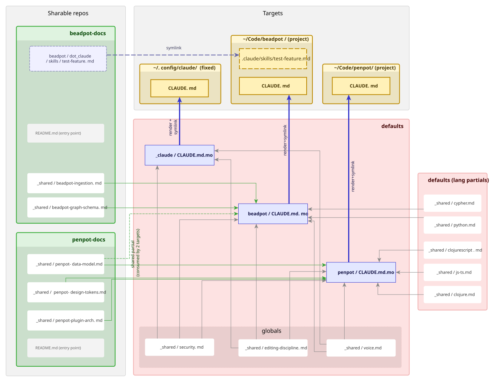

# repo-overlays

Compose personal/team-authored Markdown guidance for AI agents into project
worktrees, without committing it upstream.

- `docs/USAGE.md`: feature specification and user workflow
- `docs/example_overlays.graphml`: full composition diagram (open with yEd)




## What it does

You maintain one or more **overlay source repos** containing Markdown files
(style guides, agent instructions, skills, slash commands). repo-overlays
**materialises** these into your project directories as symlinks, so the
agent finds them without the project repo knowing they exist.

### Example
You have a private `defaults` with your coding-style guidance and a
public `beadpot-docs` with domain knowledge. That makes two sources. Running `repo-overlay apply` produces at the target `~/Code/beadpot/`
```bash
~/Code/beadpot/
├── CLAUDE.md         #← defaults/_rendered/beadpot/CLAUDE.md (from template)
└── .claude/
    └── skills/
        └── test-feature.md  #← beadpot-docs/beadpot/dot_claude/skills/test-feature.md
```

Neither file is committed to `~/Code/beadpot/`. The agent reads them as if
they were native to the project. 

Benefits:
1. your personal guidance (i.e. `defaults`) stays out of upstream, and private
2. project notes can be git-shared 

## Bootstrapping a new repo

A repo cloned under a watched root has zero coverage until a key directory
exists for it, and nothing in the flow reminds you. So ask, then create:

```sh
repo-overlay status --unmanaged            # repos under watched roots that no key covers
repo-overlay init ~/Code/newrepo           # dry run: what each source would create
repo-overlay init ~/Code/newrepo --write   # create the key dirs, then apply
```

Each source keeps its own `_template/` skeleton holding only what that source
would own for any repo; `init` instantiates it into `<source>/<key>/`. It never
clobbers (an existing file is reported `ok:`) and never shadows a path that
another source provides for the key, or that the destination already holds as a
regular file (both `have:`). Exit codes, the four substituted variables and the
key-naming rules are in [docs/USAGE.md § `init`](docs/USAGE.md).

## Where overlays land: harnesses

**Separation of concerns.** [chezmoi](https://www.chezmoi.io/) manages files that *applications* read (settings, keybindings). repo-overlays manages files that *LLM agents* read (`CLAUDE.md`, `AGENTS.md`, skills, slash commands). The two never fight over the same file.

**Consuming harnesses.** A fixed-target key deploys guidance to an absolute path, declared by the source that owns the key:

```toml
# <source>/config.toml
[targets]
_claude = "~/.config/claude"
```

Which harnesses a machine feeds, where each reads its guidance from, and the per-harness workarounds they need (one refuses a symlinked skill file, another reads no global instructions file at all) are properties of that machine's overlay sources, not of this tool. `repo-overlay config` prints the live targets and watched roots; the reasoning behind a particular set belongs in the README of the source that declares it.

Project destinations are discovered under each source's `watched_roots`, and every git repo and linked worktree found there is a candidate.

## Glossary

| Term | Meaning |
|------|---------|
| **source** | A directory (git repo) holding overlay files. You can stack several; they are consulted in declared order. |
| **source stack** | The ordered list of sources. Later sources override earlier ones on per-file conflicts; the first source that has a partial wins for partial lookup. |
| **overlay key** | A top-level directory in a source, matched to a destination. Keys starting with `_` are *fixed targets* (bound to an absolute path); others are *project overlays* matched to a git repo by, in order: remote slug (`owner_repo`), directory basename, then bare remote repo name (`repo`). The last step lets linked worktrees match by repo identity regardless of their directory name — see [Worktrees](#worktrees). |
| **partial** | A file under `_shared/` in any source, nested paths included (`_shared/skills/<name>.md`). Pulled into templates with `{{>_shared/<path>}}`; `{{>@source/_shared/<path>}}` pins one source. |
| **template** | A `*.mo` file. Rendered via Mustache (partials resolved across the whole source stack) into `_rendered/<key>/<path>`. |
| **`_template`** | A source's bootstrap skeleton, instantiated into `<source>/<key>/` by `repo-overlay init`. Reserved like `_shared/` and `_rendered/`: never an overlay key itself. |
| **`data.toml`** | A `<key>/data.toml` makes the key *data-active*: its `.mo` templates get Mustache variables and sections rendered over the parsed TOML, after partials resolve. A key without one keeps the partial-only contract byte-identical. |
| **materialise** | The act of writing `_rendered/` output and placing a symlink at the destination. |
| **live file** | The symlink at the destination that the agent reads or writes. |
| **owned directory** | A source directory carrying an empty `.overlay-own` marker: wholly overlay-owned, so the destination excludes the *directory* (`/work/`) instead of each file under it. Keeps new files in the tree from ever being visible to git — see [USAGE.md §9.2](docs/USAGE.md). |
| **drift** | A live file whose content no longer matches a fresh render of its template — i.e. an agent has edited it since the last apply. |
| **reconcile** | The interactive step (`repo-overlay promote`) that resolves drift: diff, accept the new render, keep the agent's edit, or edit the source. |
| **watched_roots** | Parent directories whose git-repo children are auto-discovered as destinations and re-applied when any source changes. |
| **unmanaged repo** | A git repo under a watched root that no overlay key covers, so `apply` passes it by. Listed by `repo-overlay status --unmanaged`, off by default so the daily drift digest stays clean. |

## Worktrees

A linked git worktree shares its `origin` with the main checkout, so overlays
resolve by the repo's **bare remote repo name** — not the worktree's directory
name. You can therefore name and place worktrees freely; all of these resolve to
the `penpot` overlay key:

```
~/Code/worktrees/penpot-feature-x       → key `penpot` (via origin)
~/Code/worktrees/penpot-bugfix-123      → key `penpot`
~/Code/penpot/.claude/worktrees/foo     → key `penpot` (a Claude Code worktree)
```

Recommended convention: a flat `~/Worktrees/<repo>-<branch>`, added to
`watched_roots`. Location is a convention, not a constraint: linked worktrees
are enumerated with `git worktree list`, so they are found wherever they are
checked out, as long as the **main** checkout sits under a watched_root.
Overlays also apply on `cd` / file-open via the hooks, from any path.

A worktree receives its repo's overlay like any other checkout. To exclude one,
drop an empty **`.repo-overlays-skip`** file at its root: the next apply removes
whatever it had installed there (links, manifest, `info/exclude` block) and
leaves it alone from then on. Per-destination, so it suits a short-lived
worktree better than a config entry would.

Tools create worktrees in their own places unless told otherwise — Claude Code
in `<repo>/.claude/worktrees/`, omp in `~/.omp/wt`. Steering them to one tree is
per-tool: omp has a `worktree.base` setting (`OMP_WORKTREE_DIR` overrides);
Claude Code has no base-directory setting and needs a `WorktreeCreate` hook,
which replaces its git logic and returns the directory to use.

## Installation

**Prerequisites** — Python ≥ 3.11 and [uv](https://docs.astral.sh/uv/).

**Install the CLI:**

```sh
cd ~/Code/repo-overlays
uv sync
ln -sf "$PWD/.venv/bin/repo-overlay" ~/.local/bin/repo-overlay
```

### File watcher service

Save the following as `~/.config/systemd/user/repo-overlay.service`:

```ini
[Unit]
Description=Materialise repo overlays on filesystem changes

[Service]
Type=simple
ExecStart=%h/Code/repo-overlays/.venv/bin/repo-overlay watch
Restart=on-failure
RestartSec=2

[Install]
WantedBy=default.target
```

Then enable and start it:

```sh
systemctl --user daemon-reload
systemctl --user enable --now repo-overlay.service
systemctl --user status repo-overlay.service   # verify running
```

### Optional: scheduled drift digest

The watcher only reports drift it runs into. To catch broken links, missing
partials and stale `diverged:` markers that no apply touches, run
`repo-overlay status` from a daily systemd user timer and notify on a non-zero
exit. This machine does it from the dotfiles repo (`config-drift.timer`,
18:30, one `notify-send` covering both `chezmoi status` and `repo-overlay
status`) — see [docs/USAGE.md § Scheduled drift digest](docs/USAGE.md).

### Optional: mise cd hook

Fires `repo-overlay apply` whenever you `cd` into any directory. For directories under a `watched_root`, the overlay materialises immediately on entry.

Add to `~/.config/mise/config.toml`:

```toml
[settings]
experimental = true   # required for hooks

[hooks]
enter = 'repo-overlay apply "$PWD" || true'
```

The `|| true` absorbs the exit 1 that occurs when the directory has no matching overlay key, preventing shell prompt disruption.

On entry, you'll see a brief output line:
```
Overlay beadpot (defaults, beadpot-docs) → ~/Code/beadpot
```
Re-entering an already-applied repo (or cd'ing into one of its subdirectories)
is silent — the overlay is already in place once materialised.

### Optional: Emacs integration

Fires `repo-overlay apply` for the current project whenever you open a file or switch projects. Runs asynchronously so it never blocks Emacs.

```elisp
(defvar my/repo-overlay--applied (make-hash-table :test #'equal)
  "Project roots already handed to `repo-overlay apply' in this session.")

(defun my/repo-overlay-apply (&optional dir)
  "Materialise repo-overlays for DIR, or for the current project root.
Asynchronous, and at most once per root per session."
  (when-let* ((root (or dir
                        (and (fboundp 'project-current)
                             (project-current)
                             (project-root (project-current)))
                        (locate-dominating-file
                         (or buffer-file-name default-directory) ".git")))
              (root (expand-file-name root))
              ((not (gethash root my/repo-overlay--applied))))
    (puthash root t my/repo-overlay--applied)
    (call-process-shell-command
     (concat "repo-overlay apply " (shell-quote-argument root) " &")
     nil 0)))

(defun my/repo-overlay-forget ()
  "Forget which roots have been applied, so the next visit re-applies."
  (interactive)
  (clrhash my/repo-overlay--applied)
  (message "repo-overlay: memo cleared"))

(add-hook 'find-file-hook #'my/repo-overlay-apply)
(advice-add 'project-switch-project :after #'my/repo-overlay-apply)
```

Add this to your `init.el` or `early-init.el`. Requires `repo-overlay` on `$PATH` (i.e. `~/.local/bin/` in `exec-path`).

Two things worth knowing about the shape of this snippet:

- **There is no `project-switch-hook`.** Earlier revisions of this section used one. `project.el` has never defined it, and `add-hook` silently interns any symbol you hand it, so the line looked correct, raised nothing, and never ran. Advising `project-switch-project` is the working equivalent.
- **The memo is not an optimisation detail.** `find-file-hook` runs per buffer, so without it a twenty-file session forks twenty identical `apply` runs against the same root. Live edits to overlay sources are picked up by `repo-overlay.service`, not by this hook, so caching for the session costs nothing; `M-x my/repo-overlay-forget` forces a re-apply if you want one.


## Configuration

- Top-level source stack: `~/.config/repo-overlays/config.toml`
- Per-source targets and watched_roots: `<source>/config.toml`

## Quick start

```sh
repo-overlay config                  # show effective sources and targets
repo-overlay apply                   # materialise all overlays now
repo-overlay status                  # check for drift, broken links, missing partials
repo-overlay status --unmanaged      # also list watched-root repos that no key covers
repo-overlay init <path> --write     # create <path>'s key from each _template/, then apply
repo-overlay promote                 # interactive: reconcile agent-edited files
```

## Overlay repos in use

`repo-overlay config` is the answer for any given machine: it prints each source, its path, its privacy flag, its targets and its watched roots, in stack order. Nothing here duplicates that list, because a stale copy of it is worse than no copy. What a source holds, who may read it, and why it exists belong in that source's own README.
